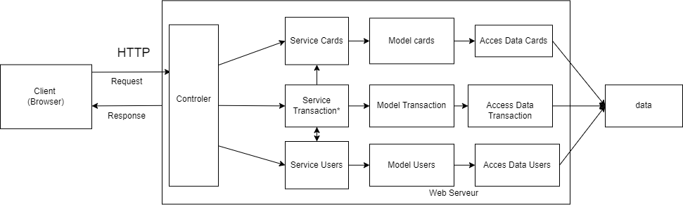

# ASI
## Contributors :
* Vincent BUNIAZET
* Lucas COUDRAIS
* Matthieu EVESQUE
* Alexis THOMAS
## Date :
* 23 Mai 2023
***
## Introduction/Context :

* Dans le cadre d'un projet scolaire, nous devions mettre en place une API entre un client et un serveur afin de comprendre l'architechture de celui-ci.

## Description Architecture : 



* L'architecture est représentée en tiers 3 soit, une partie client, une partie web serveur et une partie donnée.

### 1) La partie Client :
Dans le cas du projet, le client est représenté par une application web ou l'utilisateur peut utiliser via POSTMAN ou curl (ou autre)

_Example curl :_ 
``` curl -X POST localhost:8080/card  -H 'Content-Type: application/json' -d '{"id":1,"name":"totoro","family":"Polo","description":"Gros bison futé","affinity":"Grass","imageUrl":"https://png.pngtree.com/png-clipart/20220922/original/pngtree-weed-monsters-cartoon-png-image_8627547.png","hp":55,"defence":22,"energy":21,"attack":50}'  ```

Les liens disponibles :
- localhost:8080/add-card
- localhost:8080/cardview/?id avec ?id qui est la valeur de la carte.

### 2) La partie Web serveur :
    
* Elle possède un controller qui permet de recevoir les requêtes en HTTP et de les transformer pour qu'elle soit utilisable par un service. 

* Le service permet de contrôler les données, la forme de celle-ci, la validité et de modifier le modèle.

* Le modèle permet de stocker les données dans un format donné et objet. 

* Les accès permettent de contacter la base de donnée ou autres éléments qui permet de stocker des données. 

* Le bloc de data permet de stocker des données de façon permanante. 


